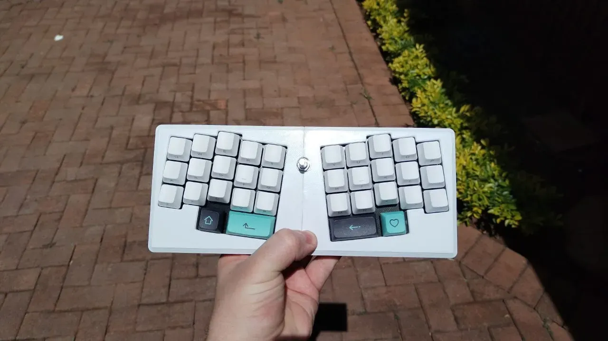

# LeChiffreHandwire3DPrint

A modification of tominabox's Le Chiffre to make the plates suitable for 3d printing and adding standoffs for a pi pico micro controller.

making the plate thicker helps with stiffness for 3d printed plate only (when pcb is not present)

I also removed the logo and filled in the oled hole.

this was modified from  the v16 case files from [tominabox's repo](https://github.com/tominabox1/Le-Chiffre-Keyboard/blob/master/Cases/OG%20Case/Le%20Chiffre%20v16.step) 

the case unfortunately does not fit on an ender 3 print bed. I may try to fix that as well.

